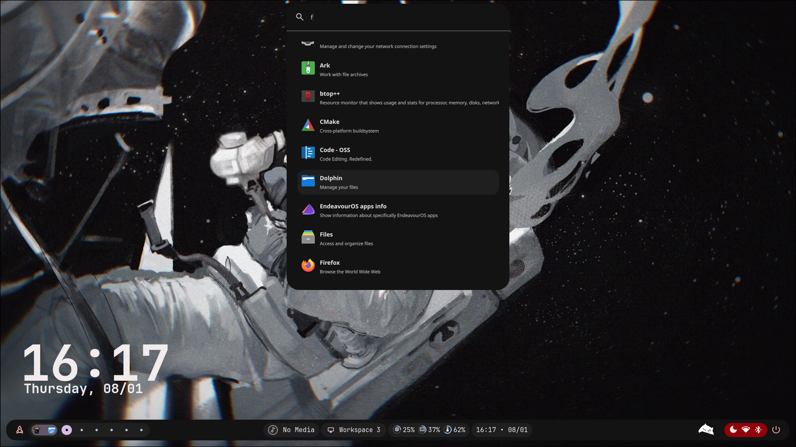

<div align="center">

#  aelyx-shell 

A compact, performance-oriented dotfiles collection implemented with QuickShell and Hyprland.

<p>
  
  &nbsp;
  
  &nbsp;
  
  &nbsp;
  
</p>

</div>

---

## Overview

aelyx-shell is a set of shell dotfiles and utility scripts authored in QuickShell. The collection emphasizes:

- Modularity: split, documented modules for aliases, functions, prompts, and environment.
- Predictability: explicit, reproducible installation and upgrade paths.
- Performance: lightweight helpers and minimal startup overhead.
- Portability: easy to adapt to different distributions and terminal environments.

Target users: developers and linux users who prefer script-first shell configurations.

---

## Previews

| Desktop                                          | Launcher                                           |
| ------------------------------------------------ | -------------------------------------------------- |
|  |  |

---

## Features

- Core QuickShell modules for aliases, environment variables, and core utilities
- Prompt and completion integrations (configurable)
- Optional platform-specific hooks (in work)
- Minimal external dependencies
- Clear file layout for straightforward customization

---

## Repository layout

- /dots/           — Main shell dotfiles
- /dots-extra/     — Extra dotfiles and wallpapers
- /license/        — License details
- /previews/       — Example previews
- bootstrap.sh     — Dependency installation script

---

## Installation (recommended)

1. Clone the repository:
    ```bash
    git clone https://github.com/xZepyx/aelyx-shell.git ~/.aelyx-shell
    cd ~/.aelyx-shell
    ```

2. Review configuration and optional modules:
    - Inspect `dots/` and `dots-extra/` before applying changes to your profile.

3. Run the bootstrap script (install dependencies):
    ```bash
    bash bootstrap.sh
    ```

4. Copy config files and make config folders (Make sure you're in the clone repo dir):
    ```bash
    mkdir -p ~/.config && mkdir -p ~/.local/aelyx && cp -r dots/.config/* ~/.config/* && cp -r dots/.local/aelyx/* ~/.local/aelyx/*
    ```

5. Reload your shell or start a new session

Notes:
- The bootstrap script is intentionally conservative.
- Manual installation (symlinking files yourself) is supported and recommended for cautious users.

---

## Configuration and customization

- Enable or disable modules by editing `~/.config/aelyxshell/config.json` or configuring the shell.
- Prompt and completion settings are separated into dedicated modules for easy replacement.

---

## Recommended environment

- Shell: QuickShell-compatible environment (see QuickShell docs) (Hyprland is Recommended)
- Terminal: A modern terminal emulator (Kitty is Recommended)
- Fonts: A patched monospace font with ligatures is optional for prompts and status displays 
- Git: recommended for dotfile updates and synchronization

---

## Troubleshooting

- Function or alias missing: verify module file execution order in `~/.config/quickshell/shell.qml`.
- Performance on startup: disable unused modules or lazy-load heavy features.
- Conflicting user configs: check for existing profile files (`~/.bashrc`, `~/.profile`, `~/.zshrc`) before bootstrapping.


---

## Roadmap

- Add declarative per-host package manifests
- Optional systemd user services for background helpers
- Official example configurations for major distributions
- CI checks for syntax and module import errors

---

## Contributing

Contributions are accepted following the repository's contribution guidelines. When contributing:
- Open concise issues with reproduction steps.
- Submit focused PRs with clear descriptions and tests where applicable.
- Respect code structure and naming conventions used in `dots/`.

Refer to GITHUB CONTRIBUTING for details.

---

## Maintainer

- Maintainer: xZepyx 
- Contact: [zepyxunderscore@gmail.com](mailto:zepyxunderscore@gmail.com)

---

## Acknowledgments

- QuickShell and its contributors
- Projects and patterns that inspired the modular layout and bootstrap approach

---

## License

© 2025 xZepyx (Aditya Yadav) 
Licensed under GNU GPLv3.
